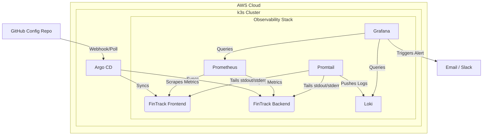

# 🚀 FinTrack: Kubernetes GitOps & Observability Platform


## 📌 Overview
FinTrack is a production-simulated microservices environment demonstrating a modern, self-healing DevOps lifecycle. This project showcases the deployment of a robust GitOps pipeline, centralized full-stack observability, and automated incident alerting on an AWS-hosted Kubernetes cluster.

The core objective of this architecture is to minimize **Mean Time to Resolution (MTTR)** through proactive monitoring, single-pane-of-glass log correlation, and automated state reconciliation.

---

## 🏗️ Architecture & Tech Stack

### Infrastructure & Orchestration
* **Cloud Provider:** AWS EC2 (`t3.medium`), Elastic Block Store (EBS)
* **Container Orchestration:** Kubernetes (`k3s` for lightweight edge simulation)
* **Workloads:** FinTrack application (FastAPI decoupled microservices)

### Continuous Delivery (GitOps)
* **Controller:** Argo CD
* **Strategy:** Declarative infrastructure. All cluster states are pulled directly from Git. Manual deviations (configuration drift) are automatically detected and overwritten.

### Observability & Alerting
* **Metrics:** Prometheus, `kube-state-metrics`, Node Exporter
* **Log Aggregation:** Grafana Loki (lightweight/cost-optimized configuration), Promtail
* **Visualization:** Grafana Dashboards
* **Alerting Engine:** Grafana Unified Alerting (PromQL-based) routed via SMTP.

---
## ⚙️ System Topology



---

## 🛠️ Key Implementations & Highlights

### 1. Unified Observability (Single Pane of Glass)
Instead of relying on isolated SSH debugging or manual `kubectl logs`, this project implements a unified observability dashboard. Developers can visualize pod CPU/Memory limits directly alongside real-time log streams using **LogQL** and **PromQL** to instantly correlate resource spikes with application errors.

### 2. Proactive Alerting & Dynamic Routing
Engineered custom PromQL alert rules to detect infrastructure degradation before users are impacted. 
* **Example Rule:** Monitors the `kube_pod_container_status_waiting_reason` metric. If a container enters a `CrashLoopBackOff` state for more than 2 minutes, it triggers a critical email alert.
* **Templating:** Utilizes Go templating to dynamically inject `$labels.pod` and `$labels.instance` into the alert payload for instant context.

### 3. Real-World Incident Response Simulation
During the deployment phase, the architecture was tested against a simulated **Storage Exhaustion Outage**:
* **Symptoms:** Pods transitioning into `Evicted` and `Pending` states; Loki database connection refusals.
* **Diagnosis:** Identified an underlying AWS EBS bottleneck causing node disk pressure.
* **Resolution:** Executed a live, zero-downtime volume expansion using AWS EC2 storage APIs, `growpart`, and `resize2fs`, successfully restabilizing the Kubernetes scheduler and triggering a Loki Write-Ahead Log (WAL) auto-recovery.

---

## 🚀 Quick Start / Deployment Steps

1. **Provision Infrastructure:** Spin up an AWS EC2 instance and install `k3s`.
2. **Deploy Argo CD:**
   ```bash
   kubectl create namespace argocd
   kubectl apply -n argocd -f [https://raw.githubusercontent.com/argoproj/argo-cd/stable/manifests/install.yaml](https://raw.githubusercontent.com/argoproj/argo-cd/stable/manifests/install.yaml)
   ```
3. **Deploy Observability Stack:**
   ```bash
   helm repo add prometheus-community [https://prometheus-community.github.io/helm-charts](https://prometheus-community.github.io/helm-charts)
   helm install prometheus prometheus-community/kube-prometheus-stack -n monitoring --create-namespace
   
   helm repo add grafana [https://grafana.github.io/helm-charts](https://grafana.github.io/helm-charts)
   helm install loki grafana/loki-stack -n monitoring --set promtail.enabled=true --set loki.persistence.enabled=false
   ```
4. **Bootstrap Application:** Apply the Argo CD `Application` manifest pointing to this Git repository to begin the automated deployment and synchronization loop.

---
